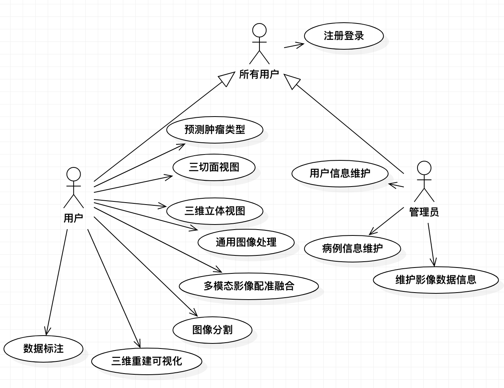

# 立项申请书

## 一、 项目的必要性

**1. 项目背景**

如今，随着计算机断层扫描、核磁共振等成像技术的出现和其在临床上的广泛使用，医学诊断和治疗技术取得了极大的进展。但是，二维图像只能显示某个切面内像素之间的相关关系，缺乏对三维对象的感知；将二维断层医学图像序列通过一定的三维重建算法形成具有真实感的立体效果图像，并通过人机交互界面，使用平移、缩放、旋转、透视、剖面等方法多角度全方位显示医学图像的内部复杂结构，可以帮助医生客观、准确的进行病体观察和病因分析，进而指导手术或制订治疗计划和评估术后效果，提高医疗诊断和分析的准确性和可靠性。因此，对医学影像数据的处理与可视化有着十分重要的研究价值和广阔的应用前景。

目前，现有的医学影像处理与分析软件平台在某些特定领域已经取得了巨大的成功，但是仍存在着如下不足：

1. 一些功能强大的商用医学影像处理与分析综合平台需要配套医疗设备或特殊硬件才能运行，其价格十分昂贵，不利于医疗工作者与高校科研人员学习使用；
2. 开源框架的软件平台二次开发学习成本过高，因为其所依赖的开源软件库过于庞大和复杂，不利于对编程开发不擅长的临床医师学习使用；
3. 由于医学影像数据本身的复杂多样性，使得现有软件平台的专业性太强，通用性不足。一些研究团队开发的医学影像处理软件平台都只能针对某种特定模态的影像，处理某种特定的任务，不能应用于其他医学影像处理领域；
4. 目前市面上免费开源的医学影像处理软件大多只能提供最为基础的功能，如三切面显示、纯手动勾画、简单的重建可视化，这些软件只能满足用户最基础的需求，倘若用户需要配准、分割、三维重建面绘制/体绘制等功能，其只能选择付费的商用软件或自行编程开发；
5. 目前大多医学影像处理软件都不含有病例数据信息存储功能，其无法回顾性地查看过往所处理的数据，并且其勾画标注的数据结果只能保存到本地，不能在远端数据库保存备份，不便于数据回顾与团队协作。

**2. 项目意义**

本项目旨在开发一套多模态医学影像配准、分割、可视化系统，集成常用的医学影像处理与分析算法，提供多模态影像配准融合、自动化图像分割、图像后处理、三维重建可视化、肿瘤良恶性预测、病例数据后端等功能，以满足医疗工作者与高校科研人员的各种实际临床需求，减少其在算法工具使用上的学习成本，帮助用户更加便捷地管理病例数据，为团队协作提供更多便利。

本项目通过提供集成了常用医学影像处理功能的用户端，为医疗工作者创造更加高效的工作条件，其中包括了多模态影像配准融合、图像的后期处理、三维重建可视化等功能，用户可以在同一平台中找到各种符合实际需求的医学影像处理功能。本项目还将搭建数据库后台，旨在储存建立医学影像及病例数据的数据库，在此基础上配合机器学习等技术生成一套针对病例的预测模型，辅助医疗工作者对病情的诊断，并且该数据库会为未来的科研和医疗工作者提供便利的研究素材。在用户使用产品前端的同时，也能够为后台数据库进行拓展补充，本项目提供的图像分割、勾画标注等功能允许用户将处理后的资料，如肿瘤病例中的肿瘤位置、良恶性、病例信息等，作为未来的研究资料录入数据库后端。

本项目通过集成常用医学影像处理方法，结合后端数据库，从而能够构建一套可成长的医学影像配准处理系统，在帮助医疗工作者更高效处理工作的同时，也为未来的研究工作提供坚实基础。

## 二、 项目外部条件落实情况

**1. 技术基础**

本项目在前端应用提供大量的医学影像处理功能，如三维数据三切面视图展示、多模态医学影像配准与融合、感兴趣区域分割、常用图像处理操作（如模糊、去噪、平滑等）、三维重建可视化（面绘制与体绘制）、感兴趣区域标注、病例数据信息存储等。

本项目通过微服务的架构构建系统后端，使用MySQL来存储数据，搭建图像数据服务器，进而让用户能够完成图像的获取，信息的备份，病例的管理等功能。

团队成员已掌握医学影像处理算法的基本原理与实现方法，前期已调研了大量医学影像配准、分割与可视化技术的相关文献与技术博客，掌握了医学影像处理开发所需要的第三方开源库：VTK、ITK，并已编程实现了部分核心算法，经测试可以应用于实际临床问题中；此外，团队成员已掌握前端开发技术，熟悉包括PC、Web、移动端各平台的开发环境，并熟悉C++、Python、Qt、MySQL等技术的使用；团队成员亦对机器学习，数据库搭建等技术有足够的熟悉程度；团队成员熟悉软件开发的基本流程，熟悉相应开发工具的使用。

**2. 研发团队**

团队拥有多位经验丰富的开发人员，且各个成员来自于不同专业，在技术上能够专业互补，经验共享，实现跨学科跨领域合作。团队成员分工明确，且均熟悉软件开发的基础流程，能够高效协作，快速开发，共同完成整个项目的构建。

**3. 项目组织机制设计**

本项目由 SJTU 公司高层亲自担任负责人，按照项目管理规范和基于 UML 的开发模式，全权负责对项目的设计和管理，协调开展。所有团队成员都对项目负责，保证项目在预期时间内取得圆满成功。

## 三、项目目标和创新点

**1. 项目主要目标**

本项目“多模态医学影像配准、分割与可视化系统”，提供桌面端应用供用户使用(医疗工作者与高校科研人员)，该桌面端应用为用户提供多模态影像配准融合、自动化图像分割、图像后处理、三维重建可视化、肿瘤良恶性预测、病例数据后端存储等功能。旨在满足医疗工作者与高校科研人员的各种实际临床需求，减少其在算法工具使用上的学习成本，帮助用户更加便捷地管理病例数据。

本项目的总体目标是：为用户提供全面的医学影像配准、分割、处理与可视化技术服务，基于人工智能技术自动检测肿瘤的类型，支持病例数据的后端，方便用户回顾性地查看过往所处理的数据。

本项目的用例图如下所示：

本项目部署图如下图所示:

整个系统的架构分为以下3个部分：

**1） 桌面端UI应用模块**

桌面端UI应用模块为用户提供了大量的医学影像处理功能，如三维数据三切面视图展示、多模态医学影像配准与融合、感兴趣区域分割、常用图像处理操作（如模糊、去噪、平滑等）、三维重建可视化（面绘制与体绘制）、感兴趣区域标注、病例数据信息存储等。用户可在桌面端应用中使用各种医学影像处理算法， 并可将原始病例数据与处理后的数据（如配准后的数据、分割与标注的数据）存储到后端数据库，实现高效数据管理，并方便其回顾性查看过往历史数据。

**2） 数据信息管理模块**

数据信息管理模块主要用于处理并管理用户的基本数据信息，例如用户注册登录信息、病例基本信息等，并同时负责基于人工智能的肿瘤类型预测任务的训练学习。该模块完成对桌面端UI应用的接口实现以及和后端数据库的对接。

**3） 数据后端存储模块**

数据后端存储模块主要完成对病例数据与处理后的数据（如配准后的数据、分割与标注的数据）的后端存储，该模块将把用户提供的数据存储到后端数据库中，便于用户数据的备份、存储与管理，方便其回顾性查看过往历史数据。同时该模块要完成和桌面端UI应用接口的实现。

**2. 项目创新点**

...

## 四、项目方案和可行性分析

**1. 项目方案**

"多模态医学影像配准、分割与可视化系统"项目采用基于 UML 的面向对象方法开发，使用 workbench 建立数据库模型，UI 端采用 Qt 进行开发，服务端使用 Python 开发，数据库使用 MySQL。使用 Github 管理项目，使用基于 Github 的 CI 来做持续集成，测试。

**2. 可行性分析**

...

## 五、计划进度

本项目计划从 2020 年 10 月 9 日起至 2021 年 1 月 6 日，用 3 个月时间完成。

**1. 2020.10.9 - 2020.11.1**

* 完成项目架构搭建，UI 端实现基本功能。

* 确定 UI 端和后端对接的接口，搭建后端图片服务器。

* 设计后端数据库，完成对接口的实现。

* 实现三切面和立体的展示。

**2. 2020.11.1 - 2020.12.1**

* 完成前后端的对接。

* 开发对图像检测的神经网络，完成训练。

* 实现配准功能。

* 实现图像分割功能。

* 完成通用的图像处理（滤波，二值化，边缘检测，模糊，去噪等功能）

**3. 2020.12.1 -2021.1.6**

* 后端图片服务器加入缓存。

* 完成 UI 端数据标注功能。

* 优化 UI 端界面。

## 六、 项目预期成果

**1. 成果形式**

完成"多模态医学影像配准、分割与可视化系统"的软件研发，实现产品化。

**2. 考核形式**

通过 SJTU 公司领导的考核验收。

**3. 交付内容**

* “多模态医学影像配准、分割与可视化系统”的源代码

* 测试计划、测试用例和测试评估报告

* 迭代计划和迭代评估报告

* 风险列表

* 软件开发计划

* 项目总结报告。

* 演示视频文件以及演示 PPT

## 七、项目社会经济效益

如今，随着计算机断层扫描、核磁共振等成像技术的出现和其在临床上的广泛使用，医疗工作者对大量的多模态医学影像数据的处理、分析与可视化的需求大大增加。然而，目前现有的医学影像处理与分析软件平台大多都只能提供最基础的可视化处理功能，更无法提供数据后端存储，信息备份管理的功能。并且功能较强的商用软件大多价钱不菲，不适合普通医疗工作者与高校科研人员的学习使用。

本项目开发的“多模态医学影像配准、分割与可视化系统”，为用户提供了较为全面的医学影像处理技术，包含了：三维数据三切面视图展示、多模态医学影像配准与融合、感兴趣区域分割、常用图像处理操作（如模糊、去噪、平滑等）、三维重建可视化（面绘制与体绘制）、感兴趣区域标注、病例数据信息存储等功能。该项目提供的医学影像处理功能涵盖了多模态影像配准融合、图像分割标注、三维重建可视化等多领域功能，可以满足绝大多数用户的科研需求。

本项目除了桌面端应用提供的医学图像处理功能外，还添加了后端数据库存储功能，可以将用户提供的病例信息、数据信息与标注信息存储到后端数据库中，便于用户备份、储存与管理病例数据，并可回顾性地查看过往历史数据，有助于团队的高效协作。

本项目通过集成常用医学影像处理方法，结合后端数据库，从而能够构建了一套可成长的医学影像配准处理系统，在帮助医疗工作者更高效处理工作的同时，也为未来的研究工作提供坚实基础，具有较高的临床使用价值。
